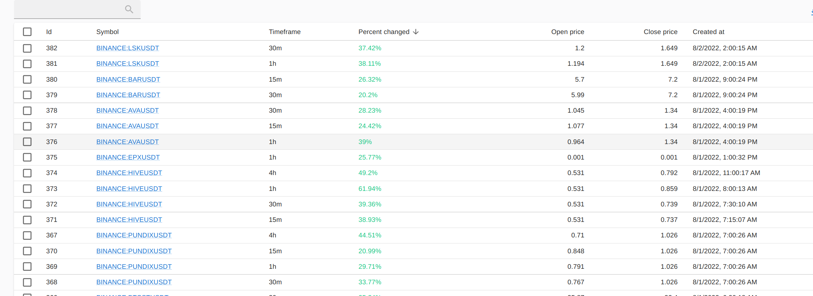

# cointracker

Cointracker a tool to help me tracking a price change in short time. IF the price change reached my target. It will sent a message to my TELEGRAM.

There are 2 components:
- Backend: contains core fuctions
- Dashboard: helps user manages alerts.

## How to run

clone .env from https://github.com/canhlinh/cointracker/blob/master/.env.sample and run
```
make run
```

## Demo



### Note:

- use admin/cointracker to access http://localhost
- to receive telegram message, you have to update configuration of the BOT:
    ```
    BOT_CHAT_ID=
    BOT_TOKEN=
    ```

## Have fun ?

Give me some ETH or BNB to: `0x1E4e1922a30d1488c8b5FBe88366FDcf100d1021`
